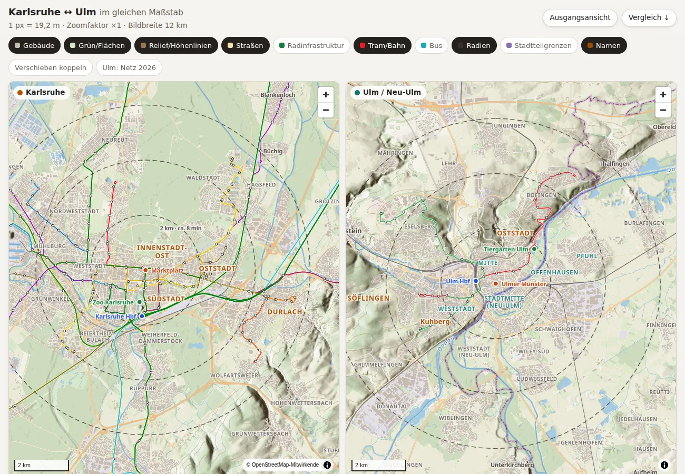
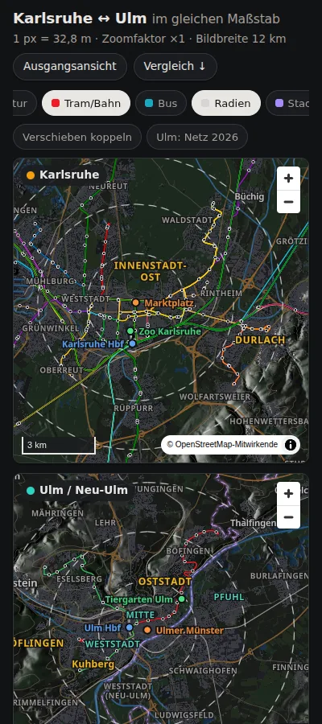

# Karlsruhe ↔ Ulm im gleichen Maßstab

An interactive web map that shows **Karlsruhe** and **Ulm / Neu-Ulm** side by side
at exactly the same ground scale, to compare urban structure, public transport,
cycling infrastructure and topography. UI language is German.

**Live:** https://m-ad.github.io/k-u-map/ (deployed by GitHub Actions from `main`)

 

## What the map shows

Two panels (side by side on wide screens, stacked on phones), each with a default
frame of 12 km × 10 km and data loaded 4 km beyond each edge.

| Chip | Content | Source |
|---|---|---|
| Gebäude | Building footprints | OSM |
| Grün/Flächen | Land use: forest, parks, farmland, residential, industrial, … | OSM |
| Relief/Höhenlinien | Hillshade (rendered in the browser from a Terrarium DEM) and 10 m contours | LGL BW / LDBV BY DGM1 |
| Straßen | Roads by class, tunnels faded | OSM |
| Radinfrastruktur | Separated tracks, shared foot/cycle paths, painted lanes, bicycle streets, bus lanes open to bikes, each styled differently | OSM |
| Tram/Bahn | Tram/Stadtbahn lines in their line colours, stops, railway infrastructure | GTFS + OSM |
| Bus | Bus lines in their line colours, stops | GTFS |
| Radien | 2/4/6 km circles around Marktplatz and Ulmer Münster, labelled with bike minutes at 15 km/h (straight-line distance) | computed |
| Stadtteilgrenzen | District boundaries; preferred districts tinted | KA Transparenzportal, OSM |
| Namen | District, quarter, town, river, road and station names | KA Transparenzportal, OSM |

Reference markers: Karlsruhe Marktplatz, Karlsruhe Hbf, Zoo Karlsruhe, Ulmer Münster,
Ulm Hbf, Tiergarten Ulm. Preferred districts (`config/project.toml`) are highlighted
in the labels.

Below the maps, the **Vergleich** panel compares both cities within 2/4/6 km of the
centre:
- building footprint share
- tram route length
- cycle infrastructure km by type
- stops
- elevation range

All values are computed by the pipeline (`data/metrics.json`), not hard-coded.

## Equal scale: how and how exact

The renderer is MapLibre GL JS (Web Mercator), chosen for vector tiles, label
collision handling, touch gestures and PMTiles support. Mercator ground resolution
depends on latitude:

    m/px = 2π·6378137 · cos φ / (512 · 2^zoom)

So equal zoom levels would show Ulm (48.4° N) about 1.2 % smaller than Karlsruhe
(49.0° N). The app keeps one shared metres-per-pixel value and sets each panel's
zoom from its **own current centre latitude**:

    zoom_ulm = zoom_ka + log2(cos φ_ulm / cos φ_ka)   (≈ +0.017 at the default centres)

This is re-applied on every zoom or pan, including the zoom-out limit, which is
enforced in m/px via `transformConstrain`.

- **Exactness:** the scale is identical at the panel centres. Within a 10 km tall
  frame, Mercator itself varies by at most ±0.09 % from the centre, almost
  identically in both cities.
- **Tests:**
  - `tests/test_scale.py` checks the math.
  - `tests/test_smoke.py` checks the live page, after real wheel-zoom and drag
    gestures, for equal m/px within 0.1 %.

"Verschieben koppeln" moves both maps by the same metric offset.

## Data sources and licences

All URLs were verified on 2026-10-01. The footer of the site lists each source with
its licence, data date and download date (from `data/manifest.json`).

| Data | Source | Licence | Notes |
|---|---|---|---|
| Base map, buildings, cycle infrastructure, district boundaries Ulm/Neu-Ulm | OpenStreetMap via [Geofabrik](https://download.geofabrik.de/) extracts `karlsruhe-regbez`, `tuebingen-regbez`, `bayern/schwaben` | ODbL 1.0 | Neu-Ulm is in Bavaria, hence Schwaben |
| Transit Ulm/Neu-Ulm | [SWU GTFS](https://www.swu.de/privatkunden/service/mobilitaet/gtfs-daten/) `gtfs.swu.de/daten/SWU.zip` | CC0 | Feed 20260312, valid until 2026-12-31 |
| Transit Karlsruhe | [NVBW "Fahrplandaten mit Liniennetz", KVV](https://www.nvbw.de/open-data/fahrplandaten/fahrplandaten-mit-liniennetz) | dl-de/by-2-0; `shapes.txt` ODbL | KVV's own CC0 feed has no `shapes.txt`, so it cannot draw lines |
| District boundaries Karlsruhe | [Transparenzportal Karlsruhe, Stadtteile](https://transparenz.karlsruhe.de/dataset/stadtteile) | CC0 | 27 Stadtteile |
| DEM Baden-Württemberg | [LGL Open GeoData DGM1](https://opengeodata.lgl-bw.de/), 2 km xyz tiles | dl-de/by-2-0 | 1 m, resampled to 5 m |
| DEM Bayern | [LDBV OpenData DGM1](https://geodaten.bayern.de/opengeodata/), 1 km GeoTIFF via metalink | CC BY 4.0 | SHA-256 verified |
| DEM gap fill | [Copernicus GLO-30](https://registry.opendata.aws/copernicus-dem/) | Copernicus DEM licence | Only outside BW/BY (≈4 % of the KA extent, west of the Rhine) |
| Line colours Karlsruhe | OSM route relations (`colour=*`) | ODbL | KVV GTFS has no colours |
| Fonts | Noto Sans via `@fontsource/noto-sans` | OFL 1.1 | |
| Software | MapLibre GL JS 6, PMTiles 4 | BSD-3-Clause | Vendored, no CDN at runtime |

**Not available:**
- **Ulm district boundaries:** datenhub.ulm.de has none (52 datasets, mostly sensors
  and parking), so Ulm and Neu-Ulm use OSM `admin_level=10`, plus `admin_level=9`
  Ortschaften that are not subdivided.
- **Neu-Ulm:** OSM, as planned.

## The 2027 Ulm/Neu-Ulm network

The joint city network starts on 1 Jan 2027. The current SWU feed (version 20260312)
runs only until 2026-12-31 and does **not** contain it. The map labels the current
network "Netz 2026". SWU publishes the new network only as web pages and PDFs, so
the map does not draw it from those, and it does not use OSM bus relations, which
reflect the old network.

Two hooks pick up the 2027 network automatically:
1. Every SWU trip is classified by its service dates. If a future feed contains
   service on or after 2027-01-01, the monthly rebuild shows the toggles
   "Netz 2026" / "Netz ab 2027" (`pipeline/gtfs_rules.py`, `NETWORK_CUTOFF`).
2. If SWU publishes a separate 2027 feed, set its URL as `url_2027` in
   `config/sources.toml`.

Once SWU replaces the feed, the 2026 network disappears from the source. To keep it,
archive `data/cache/gtfs/swu.zip` before then.

## Build

Prerequisites (Ubuntu 24.04 package names):
- [uv](https://docs.astral.sh/uv/)
- Node.js ≥ 20 with npm
- `osmium-tool`
- `tippecanoe` (2.49 works; see the note in `pipeline/tiles.py`)

```sh
sudo apt-get install osmium-tool tippecanoe
uv sync
npm ci
uv run python -m pipeline build        # download → osm → gtfs → districts → dem → tiles → metrics → site
uv run python -m pipeline.serve        # preview dist/ at http://127.0.0.1:8000 (supports HTTP Range)
uv run pytest                          # unit + data validation + browser smoke test
```

- **Single stages:** `uv run python -m pipeline gtfs metrics site`.
- **Downloads:** go to `data/cache/` (gitignored). Raw DGM tiles are about 2.6 GB,
  and a full first build takes about 25 minutes.
- **OSM source:** `KUMAP_OSM_SOURCE=mirror` uses the GWDG mirror of Geofabrik
  (Germany extract, 4.8 GB) if download.geofabrik.de is unreachable. A path to a
  local `.osm.pbf` also works.
- **Other paths:** `KUMAP_DATA_DIR` and `KUMAP_DIST_DIR` move the working and
  output directories.
- **Smoke test with a non-default Chromium:** set `PLAYWRIGHT_CHROMIUM_EXECUTABLE`.

## CI and deployment

`.github/workflows/build-deploy.yml` runs on every push to `main`, on pull requests,
monthly (2nd of each month), and on manual dispatch. It runs in this order:
1. Unit tests.
2. Full build: Geofabrik, GTFS and DEM downloads.
3. Data validation and the Playwright smoke test. Screenshots are uploaded as an
   artifact.
4. Deploy with the official Pages actions (`main` only).

Caching:
- The processed DEM is cached, keyed by frames, DEM code and year, so the raw DGM
  tiles are fetched about once a year.
- Raw OSM/GTFS downloads are cached between runs.

A failing validation fails the build.

**One-time setup:** in the repository settings, set *Pages → Build and deployment →
Source* to **GitHub Actions**.

## Known limitations

- **Mercator distortion:** about ±0.1 % inside the default frame. The scale is
  identical at both centres.
- **Tram route length:** OSM tram tracks. A track counts only where it leaves an
  8 m corridor around longer tracks, so double track counts once. Separated
  tracks at large stops add a few metres.
- **Cycle infrastructure:**
  - Road-side lanes and tracks are counted per side, standalone ways once.
  - `cycleway=shared_lane` (sharrows) is not counted.
  - `highway=track` with `bicycle=designated` counts as a shared path.
  - Quality depends on OSM tagging, which differs between the cities.
- **Transit is not fully symmetric:**
  - The SWU feed contains only SWU lines. Regional DING buses and DB trains in Ulm
    are missing.
  - The KVV feed contains the whole KVV network.
  - Regional trains are therefore shown only as OSM rail infrastructure in both
    cities.
  - Night lines, "Einsatzwagen" and rail-replacement buses are excluded.
- **Copernicus fill:** GLO-30 is a surface model (buildings, trees). It is used only
  for the strip west of the Rhine and excluded from the elevation metrics.
- **Neighbourhood labels:** OSM `place=neighbourhood` also tags housing projects. A
  configurable exclude list in `config/project.toml` filters the obvious ones.
- **Ring labels:** bike minutes are straight-line distance at 15 km/h, not routed
  times.

## Repository layout

```
config/            frames, reference points, districts (project.toml); sources and licences (sources.toml)
pipeline/          Python pipeline (python -m pipeline …), one module per stage
site/              hand-written web client (HTML/CSS/ES modules)
tests/             pytest: scale math, rules, data validation, Playwright smoke test
.github/workflows/ build, test and deploy
```

Personal data: none. The map contains public places and statistics only.
